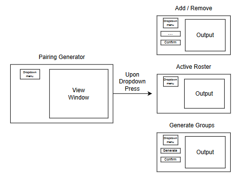

# Pairing Generator
Generates unique pairings with customizable prioritizations, and allows individuals to be added or removed.
## Overview:
Dropdown menu has options for adding / removing people, changing their priority status, or generating groups.

The adding / removing + priority have the same structure, where you type in a name and press confirm.
The output will provide feedback on whether or not the action was successful.

On generate groups: the generate will create a unique pairing based on the current status of the database.
Clicking confirm groups will forward the data from the displayed group to the database and subsequent pairing will take the new data into account.

## Setup / Use:
